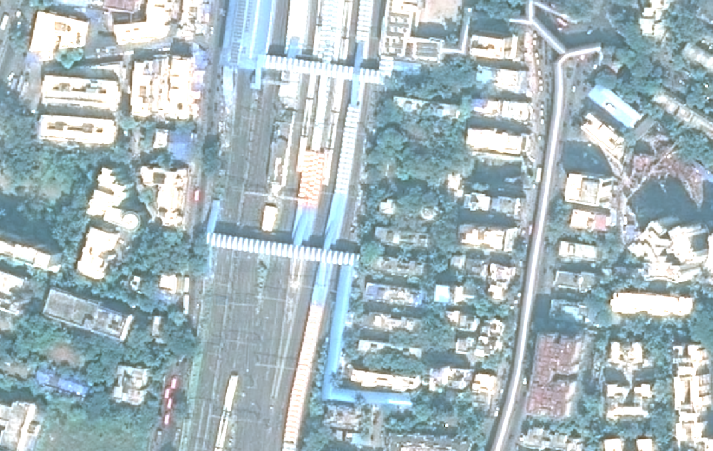

# Change Detection in Raster Imagery (Pixel-Based)

## Overview

This repository provides a pixel-level change detection pipeline for raster imagery using Python and the rasterio and numpy libraries. The project identifies changes between two temporally different satellite or aerial images and generates a colored change mask indicating additions and removals.

### Before Image


### After Image


### Output Change Mask


## Key Features

🛰️ Supports .tif and .img raster image formats.

⚖️ Normalizes pixel values before computing differences.

🎯 Pixel-wise change detection based on configurable thresholds.

🟩🟥 Visual change mask output:

Green: Added features

Red: Removed features

🗂️ Saves output as GeoTIFF with original geospatial metadata.

## Usage

### 1. Clone the Repository

```git clone https://github.com/SumitSonar/Change-Detection-in-raster-imagery-pixel-based.git ```

```cd Change-Detection-in-raster-imagery-pixel-based ```

### 2. Prepare Your Data
Ensure you have two input images of the same resolution, format, and spatial alignment:

-> before.img (or .tif)

-> after.img (or .tif)

### 3. Run the Script

```python main.py```

## Dependencies

Install required packages:

```pip install numpy rasterio```

## Author
### Sumit S. (Feel free to connect)
